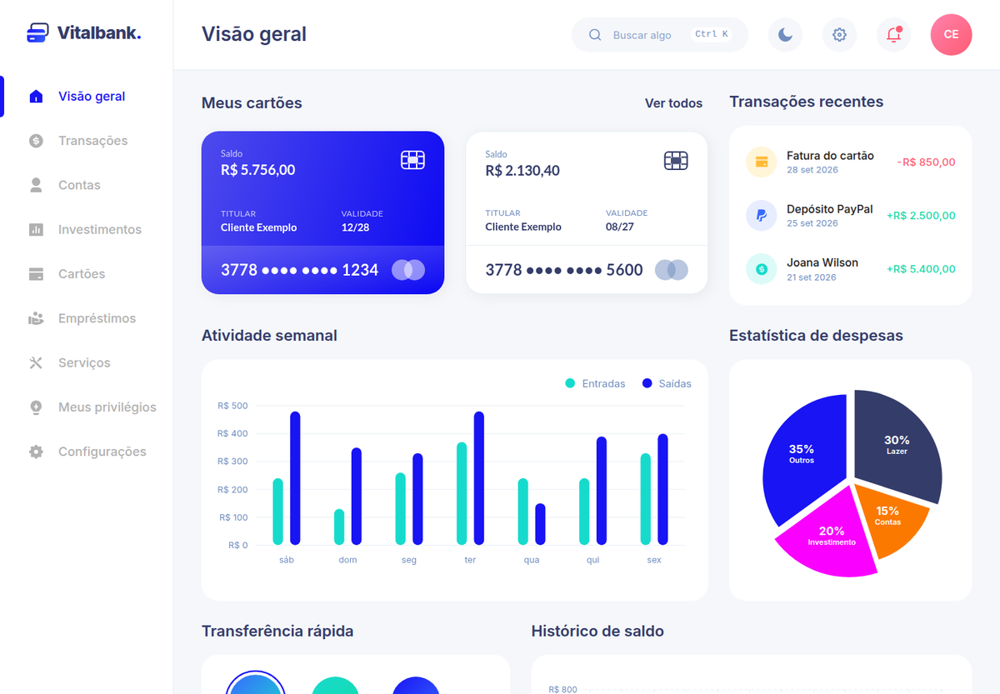
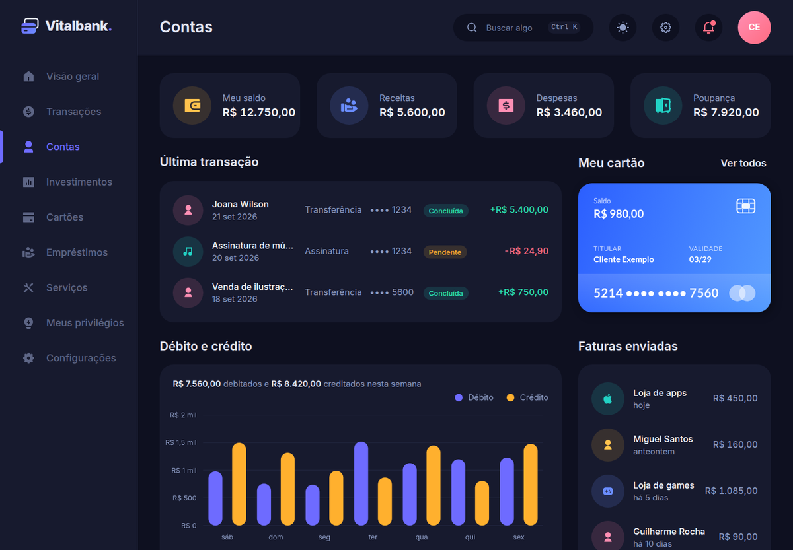
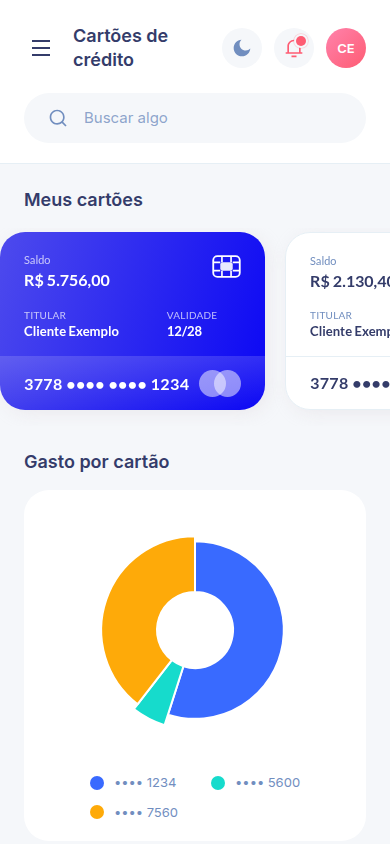
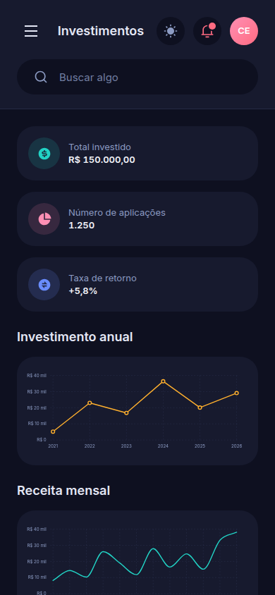

# Vitalbank

Painel de banco digital — visão geral, transações, contas, investimentos, cartões de crédito,
empréstimos, serviços, programa de pontos e configurações. Funciona em celular, tablet e computador,
nos temas claro e escuro.

**Demo:** https://victornascimento14.github.io/Vitalbank/

> **v1: só front-end, com dados fictícios.** Nenhuma tela movimenta dinheiro de verdade: transferir,
> pagar e adicionar cartão só confirmam na tela.



| Contas no tema escuro | No celular |
|---|---|
|  |   |

## O que tem

- **9 telas** do UI kit BankDash (Figma Community), em português, mais **Meus privilégios**, desenhada
  no mesmo estilo.
- **Movimento como parte do produto:** números que contam, gráficos que crescem, cartão que inclina com
  o mouse, marcador do menu que desliza, transição entre telas — e tudo some com "reduzir movimento".
- **Gráficos próprios em SVG** (barras, colunas, pizza, rosca, linha e área), cada um com uma tabela
  equivalente para leitor de tela.
- **Busca global** (Ctrl+K / ⌘K), **notificações**, **tema escuro** que se espalha a partir do botão.
- **Dinheiro em centavos inteiros**, cartão sempre mascarado, datas no horário local.

## Rodando

```bash
pnpm install
pnpm dev        # http://localhost:3000
```

Checks: `pnpm lint` · `pnpm type-check` · `pnpm test` · `pnpm build`.

## Como o código se organiza

| Pasta | O quê |
|---|---|
| `src/app/` | rotas (App Router); a casca mora no layout do grupo `(painel)` |
| `src/ui/` | design system: tokens em `globals.css`, primitivos, casca, gráficos, movimento, tema |
| `src/telas/` | os blocos de cada tela |
| `src/dados/` | tipos, sementes fictícias e a fronteira de leitura (onde o backend vai entrar) |
| `src/dominio/` | regras puras: dinheiro, datas, cartão, busca, senha, níveis |

## Documentação

| Papel | Repositório |
|---|---|
| Código (este repositório) | [VictorNascimento14/Vitalbank](https://github.com/VictorNascimento14/Vitalbank) |
| Cofre Obsidian (decisões, notas de cada PR, aprendizados) | [VictorNascimento14/Obsidian-vitalbank](https://github.com/VictorNascimento14/Obsidian-vitalbank) |

Regras de trabalho neste repositório: [`CLAUDE.md`](CLAUDE.md).

O sistema visual parte do UI kit **BankDash — Dashboard UI Kit** (Figma Community), traduzido em tokens
próprios; marca, avatares e textos são do Vitalbank.
